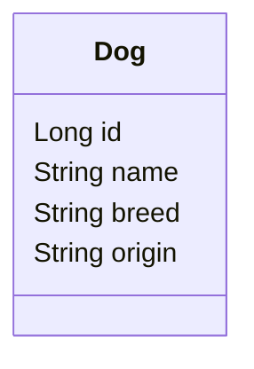
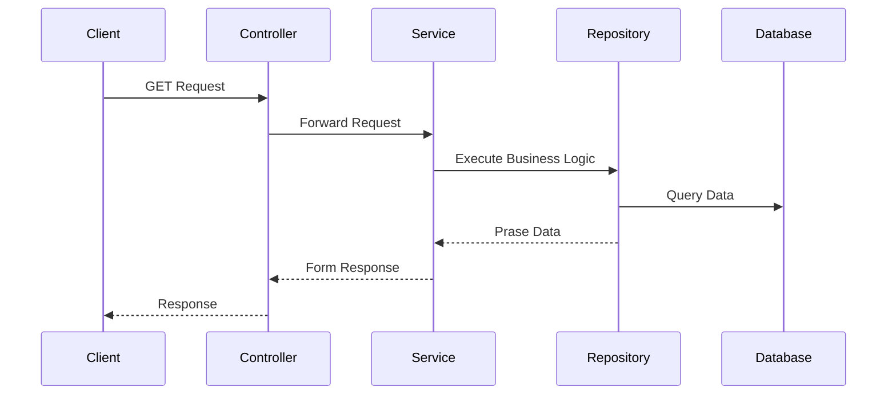

### Java Springboot - Build A Simple REST API
API that returns a list of dogs from an embedded H2 in memory database. It uses [Spring Initializer](https://start.spring.io/) to bootstrap the project with following dependencies:
1. `spring-boot-starter-web` - This starter pack is used for web application development and automatically adds libraries like Spring MVC, REST, Tomcat, and Jackson. 
2. `com.h2database` - This starter pack is used for the H2 in-memory database. 
3. `spring-boot-starter-data-jpa` - This starter pack includes JDBC, Hibernate, Transactions API, JPA, and Aspects.

### Database Entity

### Execution Flow

### API Endpoints
The following table lists the available API routes for the Dog REST API project:

| Route         | Method | Description         |
|---------------|--------|---------------------|
| `/dogs`       | GET    | Get all dogs        |
| `/dogs/breed` | GET    | Get all dogs breed  |
| `/{id}/breed` | GET    | Get breed by dog id |
| `/dogs/name`  | GET    | Get all dogs name   |
